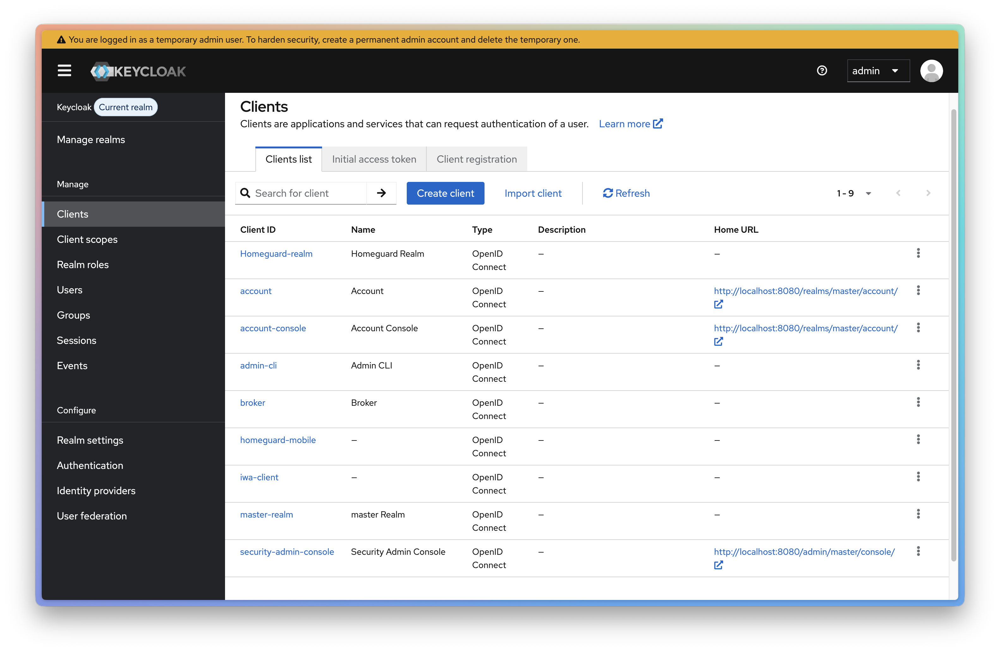
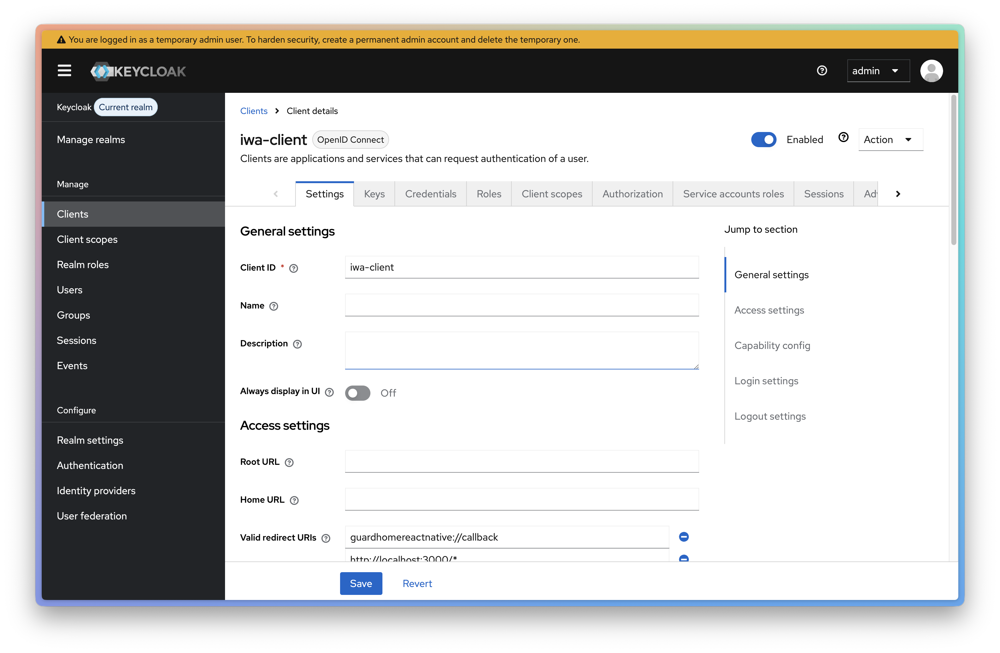
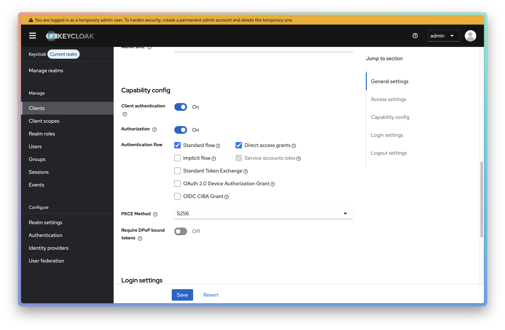
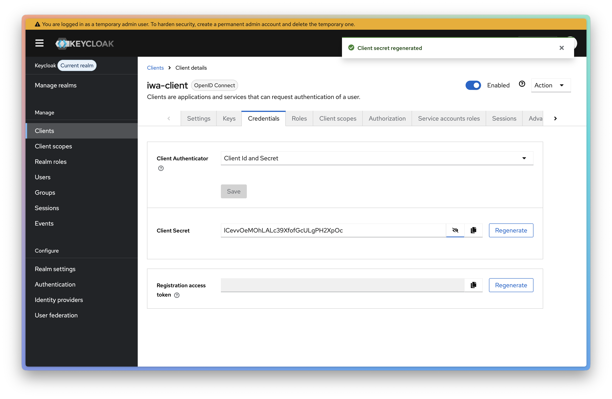
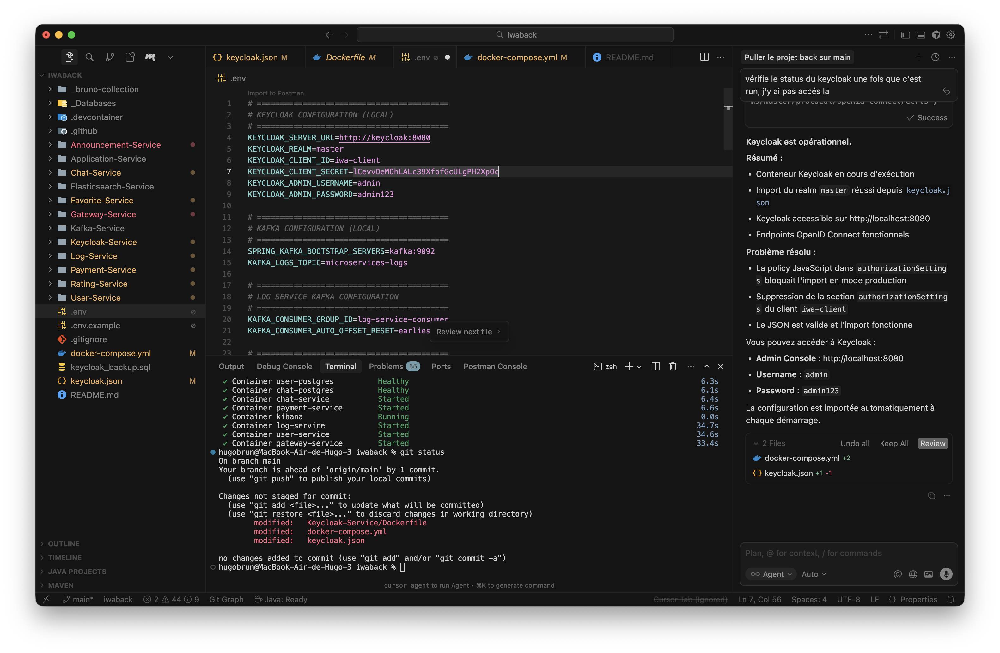

# IWA Project Backend

Microservices architecture for the IWA project with Keycloak for authentication and authorization.

## What is this?

A backend system composed of multiple microservices:

- **Gateway-Service**: Single entry point for all requests
- **User-Service**: User management
- **Announcement-Service**: Announcement management
- **Application-Service**: Application management
- **Chat-Service**: Messaging service
- **Favorite-Service**: Favorites management
- **Rating-Service**: Rating system
- **Payment-Service**: Payment processing
- **Log-Service**: Centralized logging

### Infrastructure

- **Keycloak**: Authentication and authorization (OAuth2/OIDC)
- **PostgreSQL**: Database for each service
- **Kafka**: Message broker for asynchronous communication
- **Elasticsearch**: Log storage and search
- **Kibana**: Log visualization

## Installation

### Prerequisites

- Docker & Docker Compose

### Setup

1. Clone the repository:
```bash
git clone git@github.com:hugobrun343/iwa-project-back.git
cd iwa-project-back
```

2. Copy `.env.example` to `.env`:
```bash
cp .env.example .env
```

3. Configure Keycloak client secret:
   - Start Keycloak service:
   ```bash
   docker-compose up -d keycloak-postgres keycloak
   ```
   - Wait for Keycloak to start (about 30 seconds), then open http://localhost:8080
   - Login with:
     - Username: `admin`
     - Password: `admin123`
   - Navigate to **Clients** in the left sidebar
     
   - Click on **iwa-client** in the clients list
     
   - Scroll down to **Capability config** section
   - Enable **Client authentication** (toggle ON)
   - Enable **Authorization** (toggle ON)
   - Click **Save**
     
   - Go to the **Credentials** tab
   - Copy the **Client Secret** value
     
   - Paste it in your `.env` file as the value for `KEYCLOAK_CLIENT_SECRET`
     

4. Start all services:
```bash
docker-compose up -d
```

## Keycloak Configuration

The `keycloak.json` file contains the complete Keycloak realm configuration. It is automatically imported when Keycloak starts.

- **Admin Console**: http://localhost:8080
- **Username**: `admin`
- **Password**: `admin123`

## Useful Commands

```bash
# Start all services
docker-compose up -d

# View logs
docker-compose logs -f

# Stop all services
docker-compose down

# Stop and remove volumes (⚠️ deletes data)
docker-compose down -v
```

## API Testing

The project includes a Bruno collection for API testing. See `_bruno-collection/README.md` for details.

## Monitoring

- **Kibana**: http://localhost:5601 (for log visualization)
- **Keycloak Admin**: http://localhost:8080
- **Gateway Health**: http://localhost:8085/actuator/health

## Documentation

Screenshots and visual guides are available in the `docs/screenshots/` directory.
